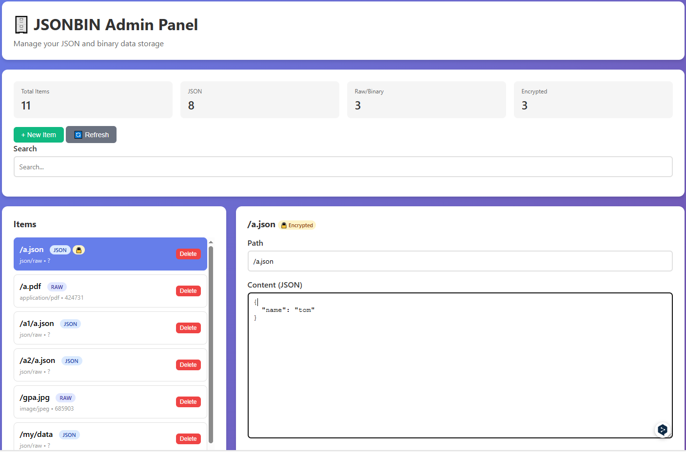

# json-bin

A simple json store based on cloudflare KV
-  read
-  write
- auto direct to url

### Admin 


### write

```bash
curl "https://jsonbin.your-account.workers.dev/test?key=yourapi" -d '{"url":"https://www.google.com"}'

curl "https://jsonbin.your-account.workers.dev/test?key=yourapi" --data-binary @data.json
curl "https://jsonbin.your-account.workers.dev/test?key=yourapi&q=url" -d "https://www.google.com"

```

### read

```bash
curl "https://jsonbin.your-account.workers.dev/test?key=yourapi"
curl "https://jsonbin.your-account.workers.dev/test?key=yourapi&q=url"

```

### direct to url

you should write json with `url` filed
then visit https://jsonbin.your-account.workers.dev/test?key=yourapi&redirect=1


## deploy on cloudflare

you can deploy this code on Workers or Pages

### create KV

Create a KV namespace
- visit https://dash.cloudflare.com
- navigate to Storage & Databases -> Workers KV -> Create Instance
- fill Namespace name `jsonbin`, then click Create

### Workers and Pages
- Create Project
- Import a repository

#### for workers

Build Command:
    npm i
Deploy command:

    npx wrangler deploy ./dist/_worker.js --compatibility-date 2025-08-31

#### for pages
Build Command:
    npm i
Build output directory:

    dist


- Environment variables (advanced) -> add Secret `APIKEYSECRET`
- after deployment, add Bindings, KV

| Type | Name | Value |
|------|------|-------|
| KV namespac | JSONBIN | jsonbin|


## dev pages locally
```bash
npx wrangler pages dev ./dist -k JSONBIN=jsonbin --compatibility-date=2025-10-08
```

```bash

# json
## json wirte read

#### upload file
curl "http://localhost:8788/test/data1.json?key=yourapi" -d @./data.json
### get file
curl "http://localhost:8788/test/data1.json?key=yourapi"
### get field
curl "http://localhost:8788/test/data1.json?key=yourapi&q=url"
curl "http://localhost:8788/test/data1.json?key=yourapi&q=name"
### update field
curl "http://localhost:8788/test/data1.json?key=yourapi&q=url" -d "http://www.bbc.com"
curl "http://localhost:8788/test/data1.json?key=yourapi&r=1" -i


### password
curl "http://localhost:8788/test/data2.json?key=yourapi&c=123" -d @./data.json
curl "http://localhost:8788/test/data2.json?key=yourapi&c=123"
curl "http://localhost:8788/test/data2.json?key=yourapi&c=123&q=name"

curl "http://localhost:8788/test/data2.json?key=yourapi&c=123&q=url" -d "http://www.bing.com"
curl "http://localhost:8788/test/data2.json?key=yourapi&c=123&r=1" -i


## forward
# https://upload.wikimedia.org/wikipedia/commons/5/57/Dogs_mating_2.jpg
curl "http://localhost:8788/share?key=yourapi&q=url" -d "https://upload.wikimedia.org"
curl "http://localhost:8788/_forward/yourapi/share/urlsplit/wikipedia/commons/thumb/6/6e/La_basilica_al_tramonto.jpg/2560px-La_basilica_al_tramonto.jpg" -o wiki.jpg
curl "http://localhost:8788/_forward/yourapi/share/urlsplit/wikipedia/commons/5/57/Dogs_mating_2.jpg" -o wiki.jpg


# binary
curl "http://localhost:8788/test/wiki.jpg?key=yourapi" --data-binary @./wiki.jpg
curl -sSL -o wiki2.jpg "http://localhost:8788/test/wiki.jpg?key=yourapi&download"

# openlist
curl "http://localhost:8788/openlist/config?key=yourapi&q=url" -d "https://consistency-fireplace-jane-sufficient.trycloudflare.com"


```